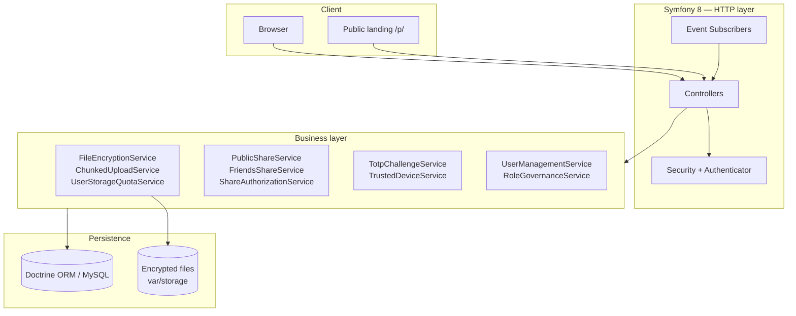

<p align="center">
  
</p>

<h1 align="center">StuWebStorage</h1>

<p align="center">
  <strong>Encrypted cloud storage platform with controlled sharing and multi-user administration.</strong><br>
  Built for self-hosting, secure by default, and tested like a real product.
</p>

<p align="center">
  
  
  
  
  
  
</p>

---

## Why this project exists

StuWebStorage addresses a concrete need: **host your own files** without relying on a SaaS, while keeping guarantees close to a commercial product — encryption at rest, granular sharing, hardened authentication, per-user quotas, and a full admin console.

This is not a demo CRUD. It is a **production-minded** application: 117 business classes, 26 migrations, 269 automated tests, end-to-end HTTP contracts, and a service-oriented, testable architecture.

---

## Visual overview

> Screenshots below are listed in [`docs/screenshots/screenshot.md`](docs/screenshots/screenshot.md).  
> Drop your PNG files in once ready — the README is already wired to display them.

### Home & authentication

| Home (light) | Login | TOTP verification |
|:---:|:---:|:---:|
|  |  |  |

### Files space

| Table view | Grid view | Media preview |
|:---:|:---:|:---:|
|  |  |  |

### Public sharing

| File landing | Password protection | Folder landing |
|:---:|:---:|:---:|
|  |  |  |

### Administration (Godview)

| All-users view | User management | Site settings |
|:---:|:---:|:---:|
|  |  |  |

---

## Key features

### Secure storage

- **AES-256-CBC encryption at rest** — segmented v2 format for large files, streaming without memory blow-up
- **Chunked upload** (8 MB chunks) — reliable transfer of large files
- **Full folder tree** — create, rename, move, delete, properties
- **Per-user quota** — real-time tracking of used and remaining space
- **Advanced search** — text filter + glob patterns (`*.pdf`, `report*`)

### Controlled sharing

- **Public links** — files and folders, with configurable expiration
- **Share password** — generation, secure vault, rate limiting
- **Email verification (TOTP)** — challenge before public download
- **Friends sharing** — named grants with fine-grained revocation
- **Dedicated landing pages** — polished UX for anonymous recipients
- **Folder ZIP** — bundled download (configurable limits)

### Authentication & security

- **Email / password login** with remember-me policy
- **Email TOTP** on every login (can be disabled per user)
- **Trusted devices** — controlled memorization, admin revocation
- **Session invalidation** — server-side session versioning
- **Site access gate** — public lock with secret bypass note
- **Symfony rate limiters** — brute-force protection on sensitive endpoints
- **Granular roles** — `ROLE_SHARE`, `ROLE_SHARE_SEND`, `ROLE_SHARE_PUBLIC`, `ROLE_SHARE_FRIENDS`

### Administration

- **Godview** — cross-user view of all storage spaces
- **User management** — invitation, roles, soft/hard delete with restorable snapshot
- **Site settings** — access gate, email templates
- **Download audit** — access traceability

### User experience

- **5 languages** — FR, EN, DE, LT, NO
- **Light / dark theme** — persisted per device
- **UI preferences** — table/grid view, columns, sort order remembered
- **Responsive interface** — mobile-first files space
- **Toasts & modals** — immediate feedback, no unnecessary reloads

---

## Architecture



### Design principles

| Principle | Implementation |
|-----------|----------------|
| **Testable services** | Business logic outside controllers, dependency injection |
| **HTTP contracts** | Functional tests locking markup and routes |
| **DTO / ViewModels** | `FilesPageViewModel`, `UserFilesCapabilities` — decoupled templates |
| **Event subscribers** | Locale, theme, storage gate, request correlation |
| **Versioned migrations** | 26 Doctrine migrations, schema validated in CI |
| **Externalized config** | `.env` for keys, quotas, TTLs, rate limits |

---

## Tech stack

| Layer | Technologies |
|-------|-------------|
| **Backend** | PHP 8.4+, Symfony 8.1, Doctrine ORM 3, DBAL 4 |
| **Frontend** | Twig, Bootstrap 5, modular vanilla JavaScript |
| **Security** | Symfony Security, OpenSSL AES-256-CBC, HTML Sanitizer |
| **Quality** | PHPUnit 11 (269 tests, 1785 assertions), PHPStan 2 |
| **Ops** | Monolog, Migrations, Rate Limiter, Mailer |

---

## Quick start

### Prerequisites

- PHP ≥ 8.4 with `ctype`, `iconv`, `gd`, `openssl` extensions
- Composer 2
- MySQL / MariaDB or PostgreSQL
- Node.js **not required** — static assets served from `public/`

### Installation

```bash
git clone <repo-url> stuwebstorage
cd stuwebstorage

composer install

cp .env.exemple .env.local
# Edit .env.local: DATABASE_URL, APP_SECRET, APP_FILE_ENCRYPTION_KEY, MAILER_DSN, DEFAULT_URI, …

php bin/console doctrine:migrations:migrate --no-interaction
php bin/console cache:clear
```

Open `/setup` to create the first administrator, then `/` to access the platform.

### Environment configuration

Copy [`.env.exemple`](.env.exemple) to `.env.local` and configure every variable below.  
Symfony merges `.env` (defaults shipped with the repo) with `.env.local` (your machine-specific overrides).

| Variable | Required | Purpose |
|----------|:--------:|---------|
| `APP_ENV` | yes | Runtime environment (`dev`, `prod`, `test`) |
| `APP_DEBUG` | yes | `1` in development, `0` in production |
| `KERNEL_CLASS` | yes | Symfony kernel class (`App\Kernel`) |
| `APP_SECRET` | yes | CSRF, remember-me, internal signing |
| `DATABASE_URL` | yes | Database connection (MySQL/MariaDB or PostgreSQL) |
| `MAILER_DSN` | yes | E-mail transport (SMTP, `null://null` for tests) |
| `DEFAULT_URI` | yes | Public base URL (absolute links from CLI) |
| `APP_TOTP_CHALLENGE_TTL_SECONDS` | yes | TOTP code lifetime (login, profile changes) |
| `APP_INVITATION_TOKEN_TTL_SECONDS` | yes | User invitation link lifetime |
| `APP_TOTP_EMAIL_FROM` | yes | Sender address for TOTP and invitation e-mails |
| `APP_PUBLIC_DOWNLOAD_CHALLENGE_TTL_SECONDS` | yes | Public download TOTP lifetime |
| `APP_PUBLIC_DOWNLOAD_CHALLENGE_COOLDOWN_SECONDS` | yes | Delay before resending a public-download code |
| `APP_PUBLIC_DOWNLOAD_CHALLENGE_MAX_RESEND_COUNT` | yes | Max resend attempts per public download session |
| `APP_FILE_ENCRYPTION_KEY` | yes | AES-256 key for files encrypted at rest |
| `APP_FILES_STORAGE_ENABLED` | yes | Enable storage module (`1` / `0`) |
| `APP_USER_STORAGE_QUOTA_BYTES` | yes | Default user quota in bytes (`0` = unlimited) |

**Generate secrets locally:**

```bash
# APP_SECRET (32 hex chars)
php -r "echo bin2hex(random_bytes(16)), PHP_EOL;"

# APP_FILE_ENCRYPTION_KEY (64 hex chars = 32 bytes)
php -r "echo bin2hex(random_bytes(32)), PHP_EOL;"
```

**Local mail catcher (dev):** point `MAILER_DSN` to Mailpit or Mailhog, e.g. `smtp://127.0.0.1:1025`.

**Never commit** `.env.local`, production credentials, or a real `APP_FILE_ENCRYPTION_KEY`.

---

## Tests & quality

```bash
# Full suite
./vendor/bin/phpunit

# Static analysis
composer analyse
```

| Metric | Value |
|--------|-------|
| Test files | 89 |
| Tests run | 269 |
| Assertions | 1,800 |
| Functional coverage | Files, Share, Admin, Home, Infrastructure |

**Functional** tests validate HTTP contracts (routes, markup, translations, permissions). **Unit** tests cover encryption, quotas, rate limiting, and admin scope resolution.

---

## Project structure

```
StuWebStorage/
├── config/              # Symfony, security, services, rate limiters
├── migrations/          # Doctrine schema (26 versions)
├── public/              # Entry point, CSS/JS, assets
├── src/
│   ├── Controller/      # HTTP — Files, Admin, Public, Profile, Setup
│   ├── Entity/          # User, SharedFile, Folder, ShareGrant, …
│   ├── Service/         # Business logic (File, Share, Auth, Admin, Site)
│   ├── Security/        # Authenticator, password holders
│   ├── EventSubscriber/ # Locale, theme, gates, session
│   └── Dto/             # ViewModels for Twig
├── templates/           # Twig — files, admin, public landing, emails
├── tests/               # Functional + Unit (269 tests)
├── translations/        # messages.{fr,en,de,lt,no}.yaml
└── docs/screenshots/    # README screenshots (see screenshot.md)
```

---

## Security notes

- Never commit `.env.local`, production secrets, or `APP_FILE_ENCRYPTION_KEY`
- Use [`.env.exemple`](.env.exemple) as the reference template; keep real values only in `.env.local`
- Key rotation requires re-encrypting existing files (not automated)
- The site access gate is an **additional** control, not a substitute for authentication
- Public shares expire — check TTLs in configuration

---

## Roadmap

- [ ] REST API / WebDAV for desktop client integration
- [ ] Optional end-to-end encryption (user-held key)
- [ ] Upload antivirus scanning
- [ ] Admin analytics dashboard
- [ ] GitHub Actions CI (PHPUnit + PHPStan + deploy)

---

## Author

**Stéphane H.** — Full-stack PHP / Symfony development  
Personal project focused on software engineering, security, and UX.

---

<p align="center">
  <sub>StuWebStorage — Encrypted storage, controlled sharing, tested code.</sub>
</p>
